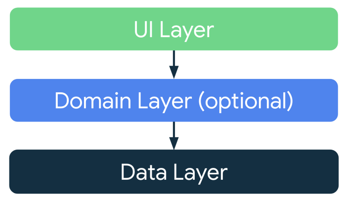

An Android app consuming [MovieDb API]("https://developers.themoviedb.org/3") to display Movie lists 
built with Jetpack Compose,Clean Architecture Principle , MVVM pattern as
well as Architecture Components.
## App
The app loads the the movies from the api and displays them in a list. When the Movie is clicked the
app navigates to the Details Screen which shows more details.


## Architecture
The app is built using the Modular MVVM architectural pattern and makes use of Android Jetpack components.
MVVM allows for the separation of concern. The app has composable screen that communicates to ViewModel
which in turn communicates to the usecase which communicates with Repository to get data.

## Prerequisite.
 To run the application you'll need add your api key in gradle.properties file. Generate your api key by [creating](https://www.themoviedb.org/signup) an IMDB account and [generating](https://www.themoviedb.org/settings/api) an api key.

## Screenshoots
These are the app's screenshots:

||

||


## Demo


## Layers.
### 1. Domain.
This is the core layer of the application. The ```domain``` layer is independent of any other layers thus ] domain models and business logic can be independent from other layers.This means that changes in other layers will have no effect on domain layer eg.  screen UI (presentation layer) or changing database (data layer) will not result in any code change withing domain layer.
Components of domain layer include:
- __Models__: Defines the core structure of the data that will be used within the application.
- __Repositories__: Interfaces used by the use cases. Implemented in the data layer.
- __Use cases/Interactors__: They enclose a single action, like getting data from a database or posting to a service. They use the repositories to resolve the action they are supposed to do. They usually override the operator “invoke”, so they can be called as a function.

### 2. Data.
The ```data``` layer is responsibile for selecting the proper data source for the domain layer. It contains the implementations of the repositories declared in the domain layer.

Components of data layer include:
- __Models__
  -__Dto Models__: Defines POJO of network responses.
- __Repositories__: Responsible for exposing data to the domain layer.
- __Mappers__: They perform data transformation between ```domain```, ```dto```models.
- __Network__: This is responsible for performing network operations eg. defining API endpoints using [Retrofit](https://square.github.io/retrofit/).


### 3. Presentation.
The ```presentation``` layer contains components involved in showing information to the user. The main part of this layer are the views and viewModels.
 

## Tech Stack
 - [Jetpack Compose](https://developer.android.com/jetpack/compose) - Jetpack Compose is Android’s modern toolkit for building native UI. It simplifies and accelerates UI development on Android. Quickly bring your app to life with less code, powerful tools, and intuitive Kotlin APIs.
 - [Viewmodel](https://developer.android.com/topic/libraries/architecture/viewmodel) - Manage UI
   related data in a lifecycle conscious way
 - [Compose](https://developer.android.com/courses/pathways/compose) - A modern declarative way
   to build android ui
 - [Retrofit](https://square.github.io/retrofit/) - Type-safe HTTP client and supports coroutines out
   of the box. Used for the network calls.
 - [Gson](https://github.com/google/gson) - Used to convert JSON to Java/Kotlin classes for the
   Retrofit
 - [okhttp-logging-interceptor](https://github.com/square/okhttp/blob/master/okhttp-logging-interceptor/README.md)
 - logs HTTP request and response data.
 - [kotlinx.coroutines](https://github.com/Kotlin/kotlinx.coroutines) - Library Support for
   coroutines
 - [Hilt](https://developer.android.com/training/dependency-injection/hilt-android) - Used for
   Dependency injection
 - [Coil](https://coil-kt.github.io/coil/compose/) - Allows for fetching and displaying of images in
   the composables

## Clean Architecture


## Clean Architecture Notes
consider reading the below note very careful. It summaries on what each layer of the clean architecture should do


